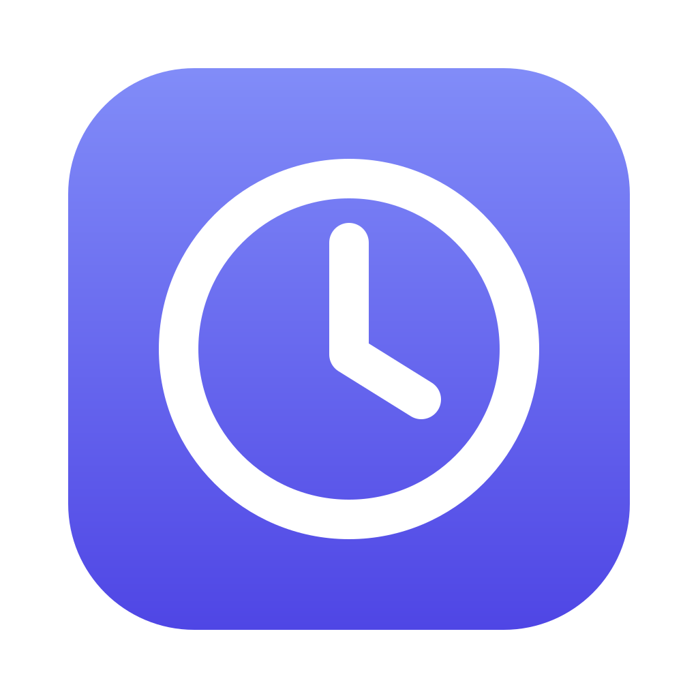

<div align="center">
  
  <h1>CronRunner</h1>
  <p>Schedule and run jobs on your own machine. Describe what you want in plain English and an LLM drafts the command and cron schedule for you to review.</p>
</div>

---

CronRunner is a desktop app for the scheduled tasks you keep meaning to set up: nightly
backups, weekly cleanups, a script that has to run every weekday at 8am. You describe the task
the way you would to a person, review the command it drafts, and it runs on your machine at the
right time.

It does not touch your system crontab. CronRunner ships its own scheduler, so the same job
behaves identically on macOS, Windows and Linux, including Windows, which has no cron at all.

## Download

Version **0.1.0**. Full instructions, including how to get past the unsigned-app warnings, are
in [docs/INSTALL.md](docs/INSTALL.md).

| Platform | Download |
| --- | --- |
| macOS, Apple silicon | [CronRunner-0.1.0-macos-arm64.dmg](https://github.com/andywater01/cron-runner/releases/download/v0.1.0/CronRunner-0.1.0-macos-arm64.dmg) |
| macOS, Intel | [CronRunner-0.1.0-macos-x64.dmg](https://github.com/andywater01/cron-runner/releases/download/v0.1.0/CronRunner-0.1.0-macos-x64.dmg) |
| Windows, 64-bit | [CronRunner-0.1.0-windows-x64.exe](https://github.com/andywater01/cron-runner/releases/download/v0.1.0/CronRunner-0.1.0-windows-x64.exe) |
| Linux, 64-bit | [CronRunner-0.1.0-linux-x64.tar.gz](https://github.com/andywater01/cron-runner/releases/download/v0.1.0/CronRunner-0.1.0-linux-x64.tar.gz) |

Each download is one self-contained app. There is no runtime to install alongside it and no
account to create. The newest version is always on the
[releases page](https://github.com/andywater01/cron-runner/releases/latest).

## What it does

- **Describe a job in plain English.** "Back up ~/Documents to ~/Backups every night at 2am"
  becomes a real command and a cron expression, with warnings for anything destructive, which
  you review and edit before saving. Refine it by asking for changes.
- **See everything at a glance.** Every job shows its schedule in plain English, when it runs
  next, and how the last run went.
- **Watch runs happen.** Output streams live while a job runs, including a run already in
  progress when you open it. Every run keeps its output, exit code and duration.
- **Fix failures.** Ask why a run failed and apply the suggested command.
- **Stay in control.** Enable, disable, run now, kill, and set timeouts, working directories,
  environment variables and per-job timezones.

## Local and private

Your jobs, run history and API key never leave your machine. There is no CronRunner server, no
account, and no telemetry. The only outbound traffic is your own calls to OpenAI or Anthropic,
with your own key, and only when you use the AI features. Everything else works without one.

The daemon runs shell commands as you, so it is deliberately reachable only from your machine:
it binds to `127.0.0.1` and rejects any request from another origin, which blocks the
cross-site attack a local server is otherwise open to. Commands drafted by the LLM are always
shown for review and never run without you saving the job.

## Building it yourself

See [docs/DEVELOPMENT.md](docs/DEVELOPMENT.md). Short version, with [Bun](https://bun.sh)
installed:

```bash
git clone https://github.com/andywater01/cron-runner.git
cd cron-runner
bun install
bun run dev:server   # API on http://127.0.0.1:4747
bun run dev:web      # UI on http://localhost:5173
```

## Stack

Bun, TypeScript, Hono, croner, bun:sqlite, React 19, Vite, Tailwind 4, TanStack Query, zod, and
the official OpenAI and Anthropic SDKs.

## Docs

| Document | What it covers |
| --- | --- |
| [INSTALL.md](docs/INSTALL.md) | Installing and first run, per platform |
| [DEVELOPMENT.md](docs/DEVELOPMENT.md) | Running from source, tests, building releases |
| [PRD.md](docs/PRD.md) | What the product is and is not |
| [ARCHITECTURE.md](docs/ARCHITECTURE.md) | How it fits together, security model, packaging |
| [DESIGN.md](docs/DESIGN.md) | UI system and page specs |
| [API.md](docs/API.md) | HTTP endpoints |
| [PLAN.md](docs/PLAN.md) | How it was built, and what each phase verified |
